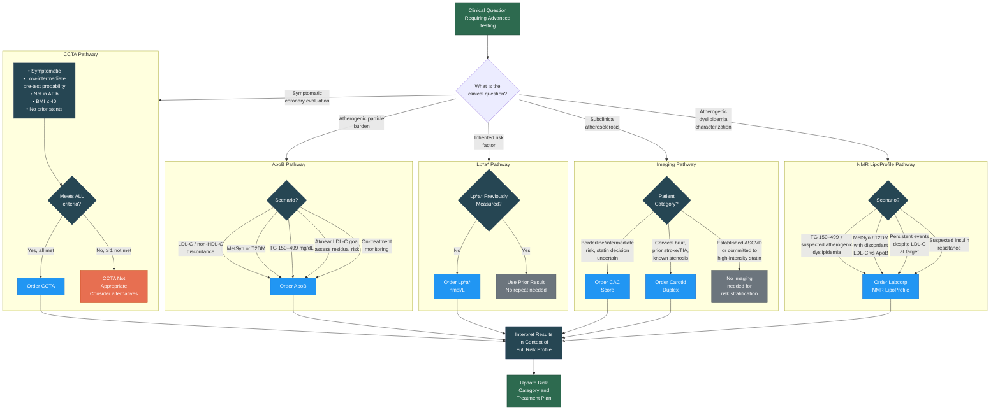

# Advanced Tools Decision Flowchart

Visual guide for determining which advanced diagnostic tool(s) to order based on clinical scenario. See [06 — Advanced Tools]() for detailed protocols.

---

---

## Quick Reference: When to Order Each Test

| Test | Order When | Do NOT Order When |
|:-----|:-----------|:-----------------|
| **ApoB** | New patients; discordance; MetSyn/DM; at/near target; monitoring | — (broadly useful) |
| **Lp(a)** | All new patients (one-time) | Already measured (genetically determined) |
| **NMR LipoProfile** | Atherogenic dyslipidemia suspected; TG 150–499; discordant results; persistent events | Routine screening; clear-cut cases |
| **CAC Score** | Borderline/intermediate risk; statin decision uncertainty | Established ASCVD; age < 40 or > 75; prior stents/CABG |
| **Carotid Duplex** | Bruit; prior stroke/TIA; known stenosis surveillance | Routine screening without clinical indication |
| **CCTA** | Symptomatic + low-intermediate risk + sinus rhythm + BMI ≤ 40 + no stents | Asymptomatic; AFib; BMI > 40; prior stents |

---

## Version History

| Version | Date | Description |
|:--------|:-----|:------------|
| 1.0.0 | 2026-03-30 | Initial release |
