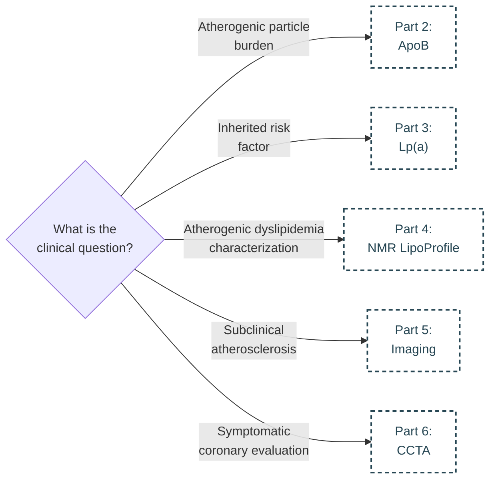
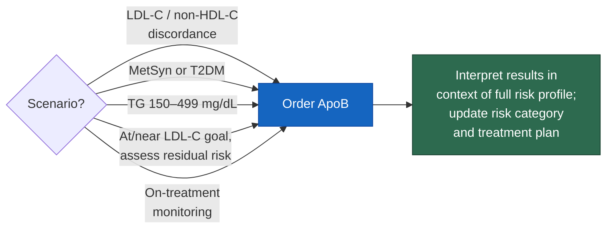
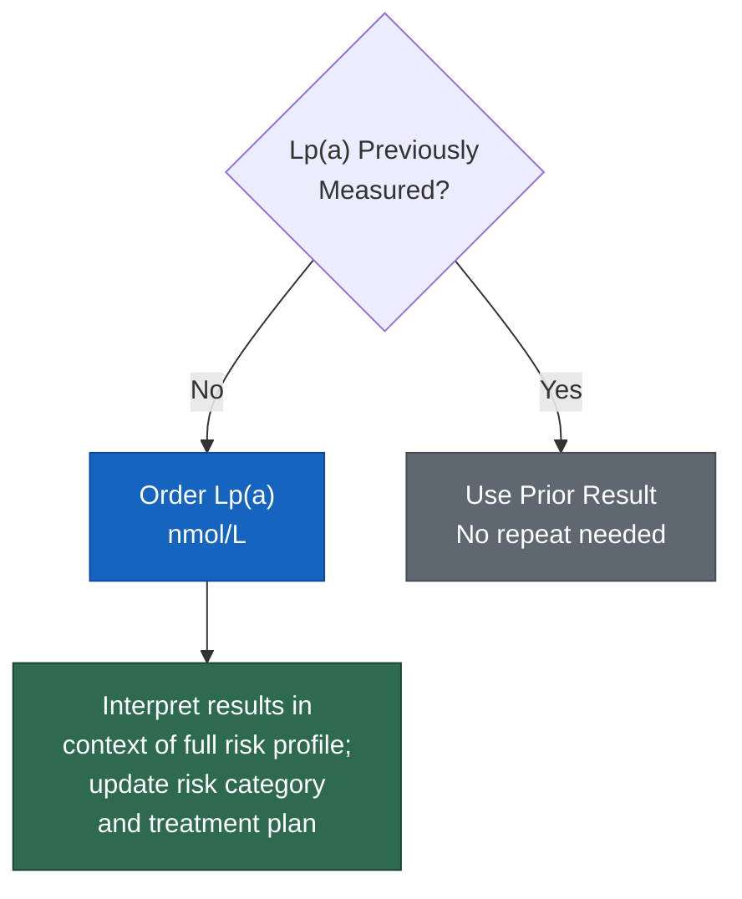
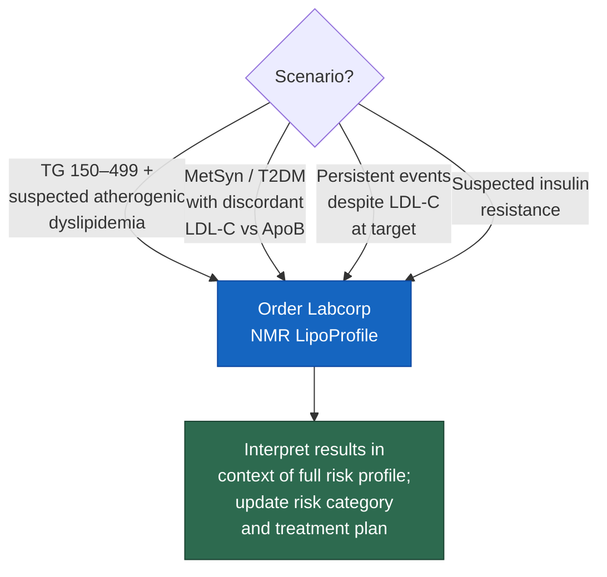
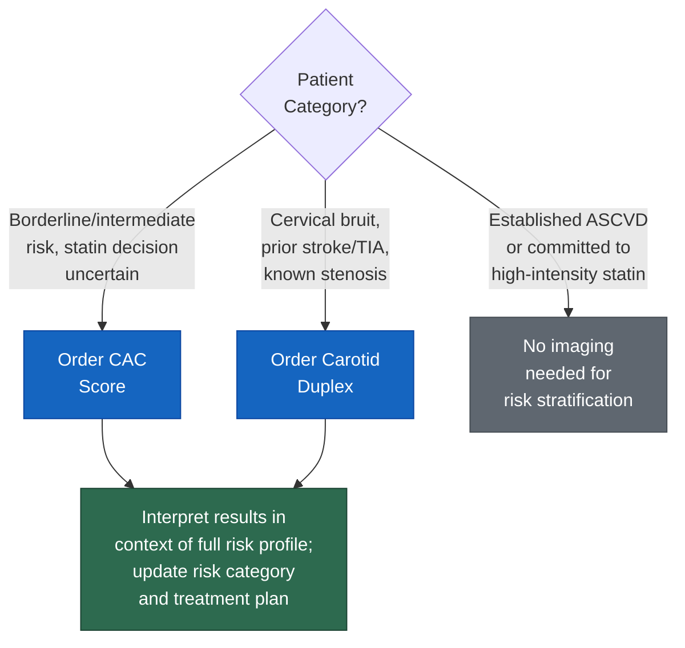
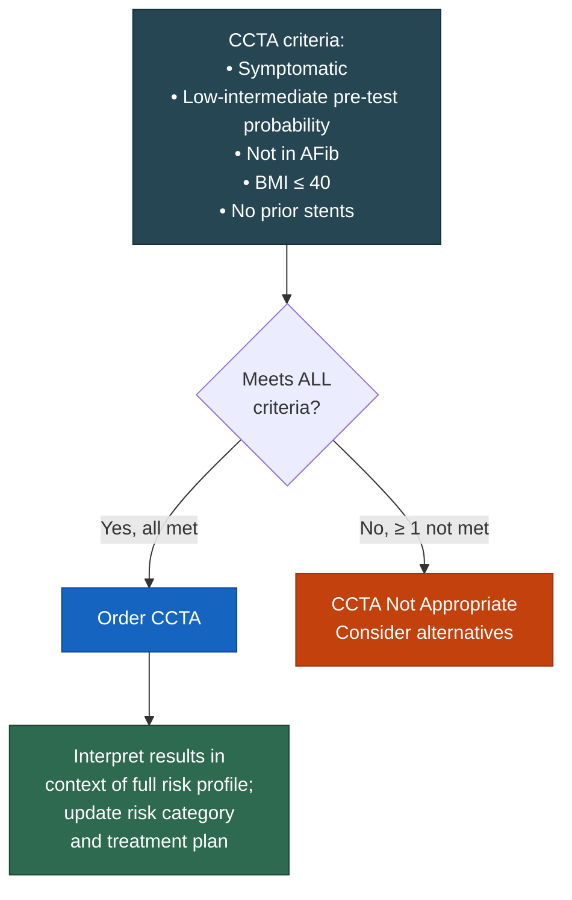

# Advanced Tools Decision Flowchart

Visual guide for determining which advanced diagnostic tool(s) to order based on clinical scenario. See [06 — Advanced Tools]() for detailed protocols.

---

Start with the clinical question in Part 1, then follow the chart for that test. Every pathway ends the same way: interpret the result in the context of the full risk profile and update the risk category and treatment plan.



## Part 1 — What Is the Clinical Question?

```mermaid
flowchart LR
    classDef entry fill:#2d6a4f,stroke:#1b4332,color:#fff
    classDef assess fill:#264653,stroke:#16303a,color:#fff
    classDef treat fill:#1565c0,stroke:#0d47a1,color:#fff
    classDef caution fill:#c2410c,stroke:#9a3412,color:#fff
    classDef urgent fill:#b42318,stroke:#7a1a12,color:#fff
    classDef admin fill:#5f6770,stroke:#454c53,color:#fff
    classDef link fill:#fff,stroke:#264653,stroke-width:2px,stroke-dasharray:5 4,color:#264653

    Q1{What is the<br>clinical question?}

    Q1 -->|Atherogenic particle<br>burden| P2[Part 2:<br>ApoB]:::link
    Q1 -->|Inherited risk<br>factor| P3["Part 3:<br>Lp(a)"]:::link
    Q1 -->|Atherogenic dyslipidemia<br>characterization| P4[Part 4:<br>NMR LipoProfile]:::link
    Q1 -->|Subclinical<br>atherosclerosis| P5[Part 5:<br>Imaging]:::link
    Q1 -->|Symptomatic<br>coronary evaluation| P6[Part 6:<br>CCTA]:::link
```

## Part 2 — ApoB

```mermaid
flowchart LR
    classDef entry fill:#2d6a4f,stroke:#1b4332,color:#fff
    classDef assess fill:#264653,stroke:#16303a,color:#fff
    classDef treat fill:#1565c0,stroke:#0d47a1,color:#fff
    classDef caution fill:#c2410c,stroke:#9a3412,color:#fff
    classDef urgent fill:#b42318,stroke:#7a1a12,color:#fff
    classDef admin fill:#5f6770,stroke:#454c53,color:#fff
    classDef link fill:#fff,stroke:#264653,stroke-width:2px,stroke-dasharray:5 4,color:#264653

    APOB_Q{Scenario?} -->|LDL-C / non-HDL-C<br>discordance| APOB[Order ApoB]:::treat
    APOB_Q -->|MetSyn or T2DM| APOB
    APOB_Q -->|TG 150–499 mg/dL| APOB
    APOB_Q -->|At/near LDL-C goal,<br>assess residual risk| APOB
    APOB_Q -->|On-treatment<br>monitoring| APOB
    APOB --> NEXT[Interpret results in<br>context of full risk profile;<br>update risk category<br>and treatment plan]:::entry
```

## Part 3 — Lp(a)

```mermaid
flowchart TD
    classDef entry fill:#2d6a4f,stroke:#1b4332,color:#fff
    classDef assess fill:#264653,stroke:#16303a,color:#fff
    classDef treat fill:#1565c0,stroke:#0d47a1,color:#fff
    classDef caution fill:#c2410c,stroke:#9a3412,color:#fff
    classDef urgent fill:#b42318,stroke:#7a1a12,color:#fff
    classDef admin fill:#5f6770,stroke:#454c53,color:#fff
    classDef link fill:#fff,stroke:#264653,stroke-width:2px,stroke-dasharray:5 4,color:#264653

    LPA_Q{"Lp(a) Previously<br>Measured?"} -->|No| LPA["Order Lp(a)<br>nmol/L"]:::treat
    LPA_Q -->|Yes| LPA_DONE[Use Prior Result<br>No repeat needed]:::admin
    LPA --> NEXT[Interpret results in<br>context of full risk profile;<br>update risk category<br>and treatment plan]:::entry
```

## Part 4 — NMR LipoProfile

```mermaid
flowchart TD
    classDef entry fill:#2d6a4f,stroke:#1b4332,color:#fff
    classDef assess fill:#264653,stroke:#16303a,color:#fff
    classDef treat fill:#1565c0,stroke:#0d47a1,color:#fff
    classDef caution fill:#c2410c,stroke:#9a3412,color:#fff
    classDef urgent fill:#b42318,stroke:#7a1a12,color:#fff
    classDef admin fill:#5f6770,stroke:#454c53,color:#fff
    classDef link fill:#fff,stroke:#264653,stroke-width:2px,stroke-dasharray:5 4,color:#264653

    NMR_Q{Scenario?} -->|TG 150–499 +<br>suspected atherogenic<br>dyslipidemia| NMR[Order Labcorp<br>NMR LipoProfile]:::treat
    NMR_Q -->|MetSyn / T2DM<br>with discordant<br>LDL-C vs ApoB| NMR
    NMR_Q -->|Persistent events<br>despite LDL-C<br>at target| NMR
    NMR_Q -->|Suspected insulin<br>resistance| NMR
    NMR --> NEXT[Interpret results in<br>context of full risk profile;<br>update risk category<br>and treatment plan]:::entry
```

## Part 5 — Imaging (CAC Score or Carotid Duplex)

```mermaid
flowchart TD
    classDef entry fill:#2d6a4f,stroke:#1b4332,color:#fff
    classDef assess fill:#264653,stroke:#16303a,color:#fff
    classDef treat fill:#1565c0,stroke:#0d47a1,color:#fff
    classDef caution fill:#c2410c,stroke:#9a3412,color:#fff
    classDef urgent fill:#b42318,stroke:#7a1a12,color:#fff
    classDef admin fill:#5f6770,stroke:#454c53,color:#fff
    classDef link fill:#fff,stroke:#264653,stroke-width:2px,stroke-dasharray:5 4,color:#264653

    IMG_Q{Patient<br>Category?}
    IMG_Q -->|Borderline/intermediate<br>risk, statin decision<br>uncertain| CAC[Order CAC<br>Score]:::treat
    IMG_Q -->|Cervical bruit,<br>prior stroke/TIA,<br>known stenosis| CAROTID[Order Carotid<br>Duplex]:::treat
    IMG_Q -->|Established ASCVD<br>or committed to<br>high-intensity statin| NOIMG[No imaging<br>needed for<br>risk stratification]:::admin
    CAC --> NEXT[Interpret results in<br>context of full risk profile;<br>update risk category<br>and treatment plan]:::entry
    CAROTID --> NEXT
```

## Part 6 — CCTA

```mermaid
flowchart TD
    classDef entry fill:#2d6a4f,stroke:#1b4332,color:#fff
    classDef assess fill:#264653,stroke:#16303a,color:#fff
    classDef treat fill:#1565c0,stroke:#0d47a1,color:#fff
    classDef caution fill:#c2410c,stroke:#9a3412,color:#fff
    classDef urgent fill:#b42318,stroke:#7a1a12,color:#fff
    classDef admin fill:#5f6770,stroke:#454c53,color:#fff
    classDef link fill:#fff,stroke:#264653,stroke-width:2px,stroke-dasharray:5 4,color:#264653

    CCTA_CRIT[CCTA criteria:<br>• Symptomatic<br>• Low-intermediate pre-test probability<br>• Not in AFib<br>• BMI ≤ 40<br>• No prior stents]:::assess
    CCTA_CRIT --> CCTA_Q{Meets ALL<br>criteria?}
    CCTA_Q -->|Yes, all met| CCTA[Order CCTA]:::treat
    CCTA_Q -->|No, ≥ 1 not met| NOCCTA[CCTA Not Appropriate<br>Consider alternatives]:::caution
    CCTA --> NEXT[Interpret results in<br>context of full risk profile;<br>update risk category<br>and treatment plan]:::entry
```

---

## Quick Reference: When to Order Each Test

| Test | Order When | Do NOT Order When |
|:-----|:-----------|:-----------------|
| **ApoB** | New patients; discordance; MetSyn/DM; at/near target; monitoring | — (broadly useful) |
| **Lp(a)** | All new patients (one-time) | Already measured (genetically determined) |
| **NMR LipoProfile** | Atherogenic dyslipidemia suspected; TG 150–499; discordant results; persistent events | Routine screening; clear-cut cases |
| **CAC Score** | Borderline/intermediate risk; statin decision uncertainty | Established ASCVD; age < 40 or > 75; prior stents/CABG |
| **Carotid Duplex** | Bruit; prior stroke/TIA; known stenosis surveillance | Routine screening without clinical indication |
| **CCTA** | Symptomatic + low-intermediate risk + sinus rhythm + BMI ≤ 40 + no stents | Asymptomatic; AFib; BMI > 40; prior stents |

---

## Version History

| Version | Date | Description |
|:--------|:-----|:------------|
| 1.0.0 | 2026-03-30 | Initial release |
| 1.1.0 | 2026-09-29 | Split into smaller charts so text renders at full size; fixed line breaks that printed as literal escape codes; accessible color palette and shared legend |
