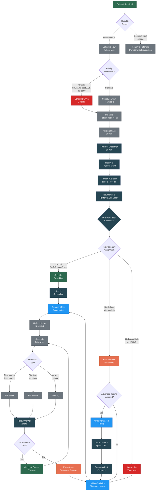

# Clinic Workflow — Master Flowchart
{: .no_toc }

This workflow illustrates the end-to-end patient journey through The Sandusky Dyslipidemia Model clinic, from referral receipt to ongoing management. For detailed documentation of each step, see the corresponding clinical documents linked below.

---

## Master Clinic Workflow

## Workflow Cross-References

| Workflow Step | Detailed Documentation |
|:--------------|:----------------------|
| Eligibility Screen | [02 — Patient Eligibility]() |
| History & Physical Exam | [03 — Initial Assessment, Sections 2.0–4.0]() |
| PREVENT Risk Calculation | [04 — Risk Stratification]() |
| Risk Category Assignment | [04 — Risk Stratification]() |
| Advanced Tools | [06 — Advanced Tools]() |
| Treatment Plan | [05 — Treatment Pathways]() |
| Follow-Up Protocol | [12 — Follow-Up Protocol]() |

## Special Pathways

The following specialty pathways branch from the master workflow at specific decision points:

| Pathway | Entry Point | Flowchart |
|:--------|:------------|:----------|
| Familial Hypercholesterolemia | LDL-C ≥ 190, tendon xanthomas, or family history of FH | [FH Pathway Flow]() |
| Statin Intolerance | Reported statin intolerance during history or treatment | [Statin Intolerance Flow]() |
| Treatment Escalation | Not at goal after initial or adjusted therapy | [Treatment Escalation Flow]() |
| Risk Stratification Detail | PREVENT calculation and advanced testing decisions | [Risk Stratification Flow]() |
| Advanced Tools Decision | Which advanced test to order and when | [Advanced Tools Decision Flow]() |

---

## Version History

| Version | Date | Description |
|:--------|:-----|:------------|
| 1.0.0 | 2026-03-30 | Initial release |
