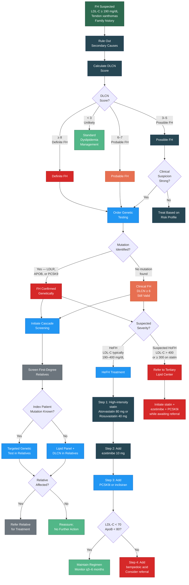

# Familial Hypercholesterolemia Pathway Flowchart

Visual representation of the FH evaluation and management pathway described in [07 — FH Pathway]().

---

---

## Key Decision Points

| Node | Clinical Document Reference |
|:-----|:---------------------------|
| DLCN Score calculation | [07 — FH Pathway, Section 3.0](#30-clinical-diagnosis--dutch-lipid-clinic-network-dlcn-score) |
| Genetic testing | [07 — FH Pathway, Section 4.0](#40-genetic-testing) |
| Cascade screening | [07 — FH Pathway, Section 5.0](#50-cascade-screening) |
| HeFH treatment | [07 — FH Pathway, Section 6.0](#60-treatment-of-heterozygous-fh-hefh) |
| HoFH referral | [07 — FH Pathway, Section 7.0](#70-severe-fh-and-homozygous-fh-hofh) |
| Secondary causes | [09 — Secondary Dyslipidemia]() |

---

## Version History

| Version | Date | Description |
|:--------|:-----|:------------|
| 1.0.0 | 2026-03-30 | Initial release |
