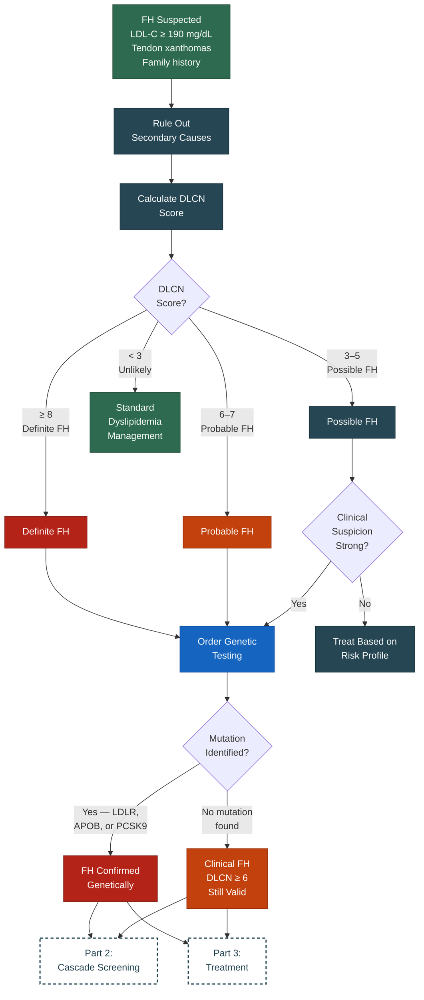
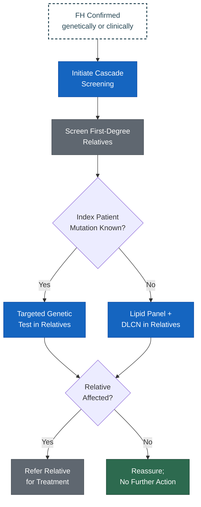
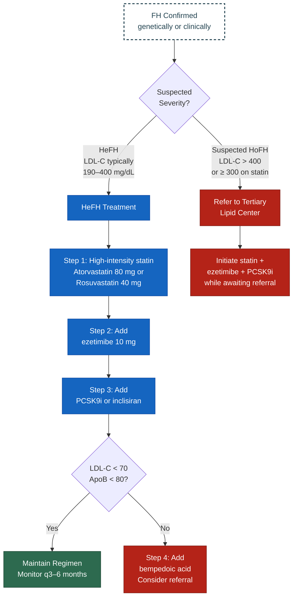

# Familial Hypercholesterolemia Pathway Flowchart

Visual representation of the FH evaluation and management pathway described in [07 — FH Pathway]().

---

The pathway is split into three charts. Part 1 establishes the diagnosis. Once FH is confirmed (genetically, or clinically with DLCN ≥ 6), Parts 2 and 3 both apply: screen the family and treat the patient.



## Part 1 — Diagnosis

```mermaid
flowchart TD
    classDef entry fill:#2d6a4f,stroke:#1b4332,color:#fff
    classDef assess fill:#264653,stroke:#16303a,color:#fff
    classDef treat fill:#1565c0,stroke:#0d47a1,color:#fff
    classDef caution fill:#c2410c,stroke:#9a3412,color:#fff
    classDef urgent fill:#b42318,stroke:#7a1a12,color:#fff
    classDef admin fill:#5f6770,stroke:#454c53,color:#fff
    classDef link fill:#fff,stroke:#264653,stroke-width:2px,stroke-dasharray:5 4,color:#264653

    TRIGGER[FH Suspected<br>LDL-C ≥ 190 mg/dL<br>Tendon xanthomas<br>Family history]:::entry

    TRIGGER --> SECONDARY[Rule Out<br>Secondary Causes]:::assess
    SECONDARY --> DLCN[Calculate DLCN<br>Score]:::assess

    DLCN --> SCORE{DLCN<br>Score?}

    SCORE -->|≥ 8<br>Definite FH| DEFINITE[Definite FH]:::urgent
    SCORE -->|6–7<br>Probable FH| PROBABLE[Probable FH]:::caution
    SCORE -->|3–5<br>Possible FH| POSSIBLE[Possible FH]:::assess
    SCORE -->|"&lt; 3<br>Unlikely"| STANDARD[Standard<br>Dyslipidemia<br>Management]:::entry

    DEFINITE --> GENETIC[Order Genetic<br>Testing]:::treat
    PROBABLE --> GENETIC
    POSSIBLE --> CONSIDER{Clinical<br>Suspicion<br>Strong?}
    CONSIDER -->|Yes| GENETIC
    CONSIDER -->|No| TREATPOSS[Treat Based on<br>Risk Profile]:::assess

    GENETIC --> RESULT{Mutation<br>Identified?}

    RESULT -->|Yes — LDLR,<br>APOB, or PCSK9| CONFIRMED[FH Confirmed<br>Genetically]:::urgent
    RESULT -->|No mutation<br>found| CLINICAL[Clinical FH<br>DLCN ≥ 6<br>Still Valid]:::caution

    CONFIRMED --> P2[Part 2:<br>Cascade Screening]:::link
    CONFIRMED --> P3[Part 3:<br>Treatment]:::link
    CLINICAL --> P2
    CLINICAL --> P3
```

## Part 2 — Cascade Screening of Relatives

```mermaid
flowchart TD
    classDef entry fill:#2d6a4f,stroke:#1b4332,color:#fff
    classDef assess fill:#264653,stroke:#16303a,color:#fff
    classDef treat fill:#1565c0,stroke:#0d47a1,color:#fff
    classDef caution fill:#c2410c,stroke:#9a3412,color:#fff
    classDef urgent fill:#b42318,stroke:#7a1a12,color:#fff
    classDef admin fill:#5f6770,stroke:#454c53,color:#fff
    classDef link fill:#fff,stroke:#264653,stroke-width:2px,stroke-dasharray:5 4,color:#264653

    IN[FH Confirmed<br>genetically or clinically]:::link --> CASCADE[Initiate Cascade<br>Screening]:::treat

    CASCADE --> FAMILY[Screen First-Degree<br>Relatives]:::admin
    FAMILY --> FAMMETHOD{Index Patient<br>Mutation Known?}
    FAMMETHOD -->|Yes| TARGETED[Targeted Genetic<br>Test in Relatives]:::treat
    FAMMETHOD -->|No| LIPIDSCREEN[Lipid Panel +<br>DLCN in Relatives]:::treat

    TARGETED --> FAMRESULT{Relative<br>Affected?}
    LIPIDSCREEN --> FAMRESULT
    FAMRESULT -->|Yes| FAMREFER[Refer Relative<br>for Treatment]:::admin
    FAMRESULT -->|No| FAMCLEAR[Reassure;<br>No Further Action]:::entry
```

## Part 3 — Treatment

```mermaid
flowchart TD
    classDef entry fill:#2d6a4f,stroke:#1b4332,color:#fff
    classDef assess fill:#264653,stroke:#16303a,color:#fff
    classDef treat fill:#1565c0,stroke:#0d47a1,color:#fff
    classDef caution fill:#c2410c,stroke:#9a3412,color:#fff
    classDef urgent fill:#b42318,stroke:#7a1a12,color:#fff
    classDef admin fill:#5f6770,stroke:#454c53,color:#fff
    classDef link fill:#fff,stroke:#264653,stroke-width:2px,stroke-dasharray:5 4,color:#264653

    IN[FH Confirmed<br>genetically or clinically]:::link --> SEVERITY{Suspected<br>Severity?}

    SEVERITY -->|HeFH<br>LDL-C typically<br>190–400 mg/dL| HEFH_TX[HeFH Treatment]:::treat
    SEVERITY -->|Suspected HoFH<br>LDL-C > 400<br>or ≥ 300 on statin| HOFH[Refer to Tertiary<br>Lipid Center]:::urgent

    HEFH_TX --> TX1[Step 1: High-intensity statin<br>Atorvastatin 80 mg or<br>Rosuvastatin 40 mg]:::treat
    TX1 --> TX2[Step 2: Add<br>ezetimibe 10 mg]:::treat
    TX2 --> TX3[Step 3: Add<br>PCSK9i or inclisiran]:::treat
    TX3 --> GOAL{"LDL-C &lt; 70<br>ApoB &lt; 80?"}
    GOAL -->|Yes| MAINTAIN[Maintain Regimen<br>Monitor q3–6 months]:::entry
    GOAL -->|No| TX4[Step 4: Add<br>bempedoic acid<br>Consider referral]:::urgent

    HOFH --> HOFH_INIT[Initiate statin +<br>ezetimibe + PCSK9i<br>while awaiting referral]:::urgent
```

---

## Key Decision Points

| Node | Clinical Document Reference |
|:-----|:---------------------------|
| DLCN Score calculation | [07 — FH Pathway, Section 3.0](#30-clinical-diagnosis--dutch-lipid-clinic-network-dlcn-score) |
| Genetic testing | [07 — FH Pathway, Section 4.0](#40-genetic-testing) |
| Cascade screening | [07 — FH Pathway, Section 5.0](#50-cascade-screening) |
| HeFH treatment | [07 — FH Pathway, Section 6.0](#60-treatment-of-heterozygous-fh-hefh) |
| HoFH referral | [07 — FH Pathway, Section 7.0](#70-severe-fh-and-homozygous-fh-hofh) |
| Secondary causes | [09 — Secondary Dyslipidemia]() |

---

## Version History

| Version | Date | Description |
|:--------|:-----|:------------|
| 1.0.0 | 2026-03-30 | Initial release |
| 1.1.0 | 2026-09-29 | Split into smaller charts so text renders at full size; fixed line breaks that printed as literal escape codes; accessible color palette and shared legend |
