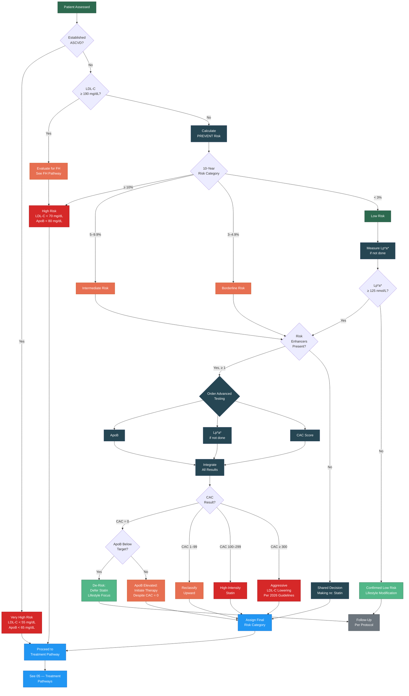

# Risk Stratification Flowchart

Visual representation of the risk stratification process described in [04 — Risk Stratification]().

---

---

## Key Decision Points

| Node | Clinical Document Reference |
|:-----|:---------------------------|
| Established ASCVD check | [04 — Risk Stratification, Section 2.0](#20-step-1--identify-established-ascvd) |
| PREVENT calculation | [04 — Risk Stratification, Section 3.0](#30-step-2--aha-prevent-risk-calculation) |
| Risk enhancers | [04 — Risk Stratification, Section 4.0](#40-step-3--evaluate-risk-enhancers) |
| ApoB assessment | [04 — Risk Stratification, Section 5.0](#50-apolipoprotein-b-apob-assessment) |
| Lp(a) assessment | [04 — Risk Stratification, Section 6.0](#60-lipoprotein-a-assessment) |
| CAC scoring | [04 — Risk Stratification, Section 7.0](#70-coronary-artery-calcium-cac-scoring) |
| De-risking (CAC=0 + ApoB negative) | [04 — Risk Stratification, Section 7.4](#74-de-risking-cac--0) |
| FH evaluation | [07 — FH Pathway]() |

---

## Version History

| Version | Date | Description |
|:--------|:-----|:------------|
| 1.0.0 | 2026-03-30 | Initial release |
