```mermaid
flowchart TD
    classDef entry fill:#2d6a4f,stroke:#1b4332,color:#ffffff
    classDef assess fill:#264653,stroke:#1d3557,color:#ffffff
    classDef caution fill:#e76f51,stroke:#c1440e,color:#ffffff
    classDef urgent fill:#d62828,stroke:#9d0208,color:#ffffff
    classDef admin fill:#6c757d,stroke:#495057,color:#ffffff
    classDef outcome fill:#2196F3,stroke:#1565C0,color:#ffffff
    classDef success fill:#52b788,stroke:#2d6a4f,color:#ffffff

    REPORT[Patient Reports\nStatin Intolerance]:::entry

    REPORT --> EVAL[Characterize\nSymptoms]:::assess
    EVAL --> SECONDARY[Rule Out Secondary\nCauses of Myalgia]:::assess

    SECONDARY --> SECCHECK{Secondary\nCause Found?}
    SECCHECK -->|Yes — Hypothyroid,\nVit D deficiency,\ndrug interaction, etc.| TREAT_SEC[Address Secondary\nCause First]:::caution
    TREAT_SEC --> RETRY[Reattempt Original\nStatin After\nCause Resolved]:::assess
    RETRY --> RETRY_RESULT{Tolerated\nNow?}
    RETRY_RESULT -->|Yes| CONTINUE[Continue Statin\nTherapy]:::success
    RETRY_RESULT -->|No| RECHALLENGE

    SECCHECK -->|No secondary\ncause identified| CK_CHECK{CK Level?}

    CK_CHECK -->|CK > 10× ULN| RHABDO[Discontinue Statin\nIV Fluids\nMonitor Renal Function]:::urgent
    CK_CHECK -->|CK 4–10× ULN| MYOPATHY[True Myopathy\nDiscontinue Statin\nRecheck CK 2–4 weeks]:::caution
    CK_CHECK -->|CK < 4× ULN\nor not checked| MYALGIA[Myalgia Without\nMyopathy\nMost Common]:::assess

    MYOPATHY --> WAIT[Wait for CK\nNormalization]:::admin
    WAIT --> RECHALLENGE
    MYALGIA --> RECHALLENGE

    subgraph RECHALLENGE [One-Time Rechallenge]
        RC_START[Select Different Statin\nPrefer rosuvastatin\nor pitavastatin]:::assess
        RC_START --> RC_DOSE[Start Lowest\nAvailable Dose\nConsider alternate-day]:::assess
        RC_DOSE --> RC_TRIAL[Trial Period\n4–8 weeks]:::admin
        RC_TRIAL --> RC_CHECK[Assess\nTolerability]:::assess
    end

    RC_CHECK --> RC_RESULT{Tolerated?}

    RC_RESULT -->|Yes| TITRATE[Titrate to Highest\nTolerated Dose]:::success
    TITRATE --> LIPIDS1[Recheck Lipids\n+ ApoB 4–8 weeks]:::admin
    LIPIDS1 --> GOAL1{At Target?}
    GOAL1 -->|Yes| MAINTAIN[Maintain Regimen]:::success
    GOAL1 -->|No| ADD_EZE[Add Ezetimibe\n10 mg daily]:::outcome

    RC_RESULT -->|No| CONFIRMED[Confirmed Statin\nIntolerance\nDocument per\nSection 6.0]:::caution

    CONFIRMED --> STATIN_FREE

    subgraph STATIN_FREE [Statin-Free Regimen]
        SF1[Start Ezetimibe 10 mg\n+ Bempedoic Acid 180 mg\nor Nexlizet combo]:::outcome
        SF1 --> SF_LABS[Recheck Lipids\n+ ApoB 4–8 weeks]:::admin
        SF_LABS --> SF_GOAL{At Target?}
        SF_GOAL -->|Yes| SF_MAINTAIN[Maintain\nStatin-Free Regimen]:::success
        SF_GOAL -->|No| SF_ESCALATE[Add PCSK9i\nor Inclisiran]:::outcome
    end

    SF_ESCALATE --> PA[Prior Authorization\nRequired]:::admin
    PA --> SF_LABS2[Recheck Lipids\n+ ApoB 4–8 weeks]:::admin
    SF_LABS2 --> SF_GOAL2{At Target?}
    SF_GOAL2 -->|Yes| SF_FINAL[Maintain\nFull Regimen]:::success
    SF_GOAL2 -->|No| SF_MAX[Maximum Statin-Free:\nEzetimibe + Bempedoic Acid\n+ PCSK9i or Inclisiran\nReassess adherence & FH]:::urgent

    RHABDO --> RHABDO_RESOLVE[After Recovery:\nDo NOT rechallenge\nProceed directly to\nStatin-Free Regimen]:::caution
    RHABDO_RESOLVE --> STATIN_FREE
```

# Statin Intolerance Pathway Flowchart

Visual representation of the statin intolerance evaluation and management pathway described in [08 — Statin Intolerance]().

---

---

## Key Decision Points

| Node | Clinical Document Reference |
|:-----|:---------------------------|
| Symptom characterization | [08 — Statin Intolerance, Section 3.1](#31-characterize-the-symptoms) |
| Secondary cause evaluation | [08 — Statin Intolerance, Section 3.2](#32-rule-out-secondary-causes-of-myalgia) |
| CK assessment | [08 — Statin Intolerance, Section 3.3](#33-creatine-kinase-ck-assessment) |
| Rechallenge protocol | [08 — Statin Intolerance, Section 4.0](#40-one-time-rechallenge-protocol) |
| Statin-free regimen | [08 — Statin Intolerance, Section 5.0](#50-statin-free-regimen) |
| Documentation | [08 — Statin Intolerance, Section 6.0](#60-documentation-requirements) |
| Prior authorization | [11 — Prior Authorization]() |

---

## Version History

| Version | Date | Description |
|:--------|:-----|:------------|
| 1.0.0 | 2026-03-30 | Initial release |
