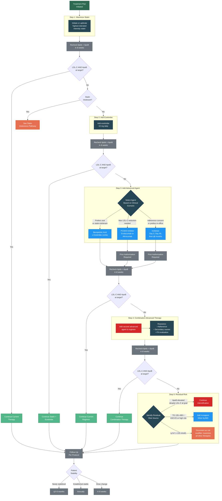

# Treatment Escalation Flowchart

Visual representation of the stepwise treatment escalation algorithm described in [05 — Treatment Pathways, Section 11.0](#110-treatment-escalation-algorithm).

---

---

## Medication Summary by Step

| Step | Agent(s) Added | Expected Additional LDL-C Reduction |
|:-----|:---------------|:------------------------------------|
| 1 | High-intensity statin | 50% or more from baseline |
| 2 | Ezetimibe | Additional 15–20% |
| 3a | PCSK9 inhibitor | Additional 50–60% |
| 3b | Inclisiran | Additional ~50% |
| 3c | Bempedoic acid | Additional 15–25% |
| 4 | Combination of Step 3 agents | Varies |
| 5 | Icosapent ethyl (TG indication) | TG reduction; ASCVD event reduction |

## Prior Authorization Cross-Reference

PCSK9 inhibitors and inclisiran require prior authorization. See [11 — Prior Authorization]() for templates and documentation requirements.

---

## Version History

| Version | Date | Description |
|:--------|:-----|:------------|
| 1.0.0 | 2026-03-30 | Initial release |
