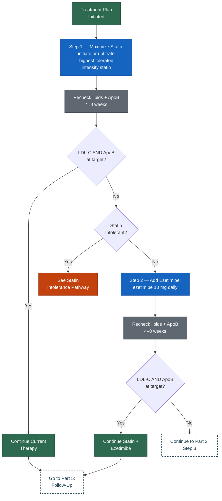
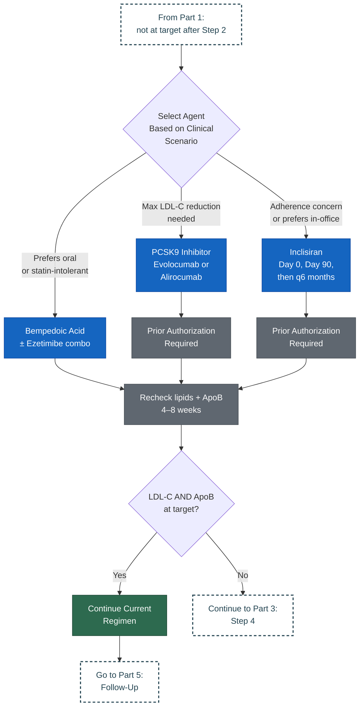
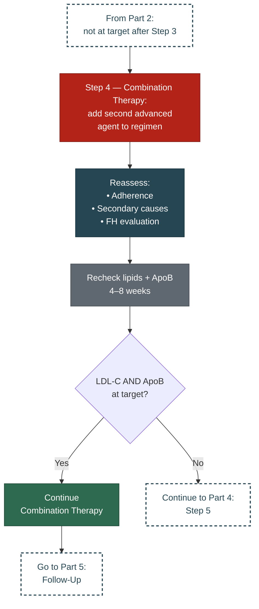
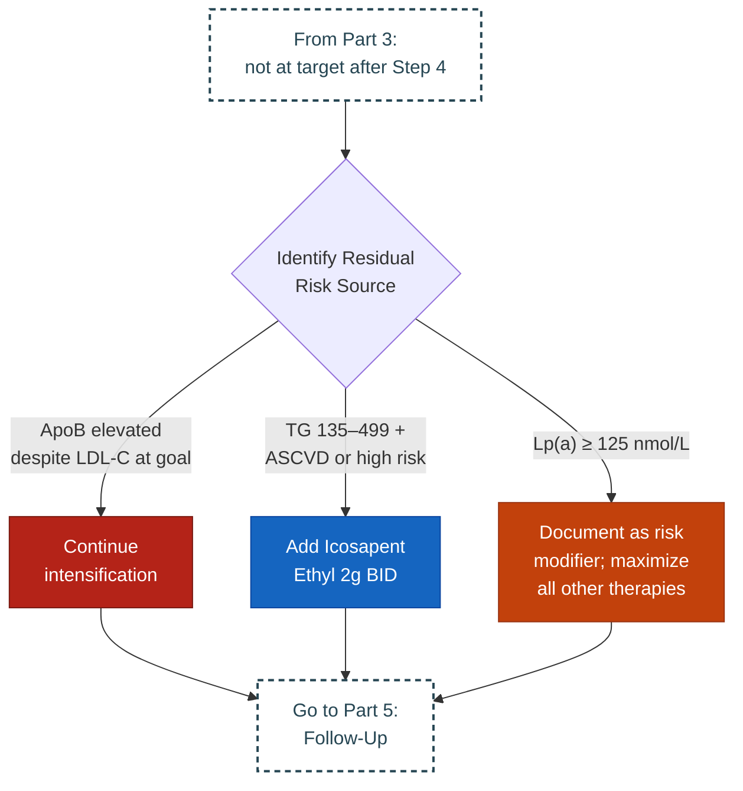
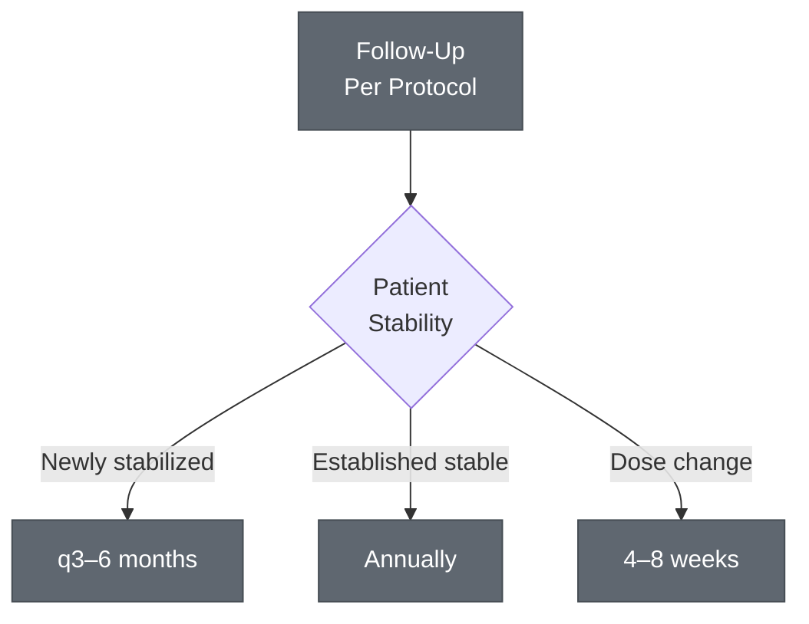

# Treatment Escalation Flowchart

Visual representation of the stepwise treatment escalation algorithm described in [05 — Treatment Pathways, Section 11.0](#110-treatment-escalation-algorithm).

---

The algorithm is split into five charts. Each patient moves to the next step only while LDL-C or ApoB remains above target; a patient who reaches target at any step goes to follow-up (Part 5).



## Part 1 — Steps 1 and 2: Statin, then Ezetimibe

```mermaid
flowchart TD
    classDef entry fill:#2d6a4f,stroke:#1b4332,color:#fff
    classDef assess fill:#264653,stroke:#16303a,color:#fff
    classDef treat fill:#1565c0,stroke:#0d47a1,color:#fff
    classDef caution fill:#c2410c,stroke:#9a3412,color:#fff
    classDef urgent fill:#b42318,stroke:#7a1a12,color:#fff
    classDef admin fill:#5f6770,stroke:#454c53,color:#fff
    classDef link fill:#fff,stroke:#264653,stroke-width:2px,stroke-dasharray:5 4,color:#264653

    START[Treatment Plan<br>Initiated]:::entry --> S1A

    S1A[Step 1 — Maximize Statin:<br>initiate or uptitrate<br>highest tolerated<br>intensity statin]:::treat

    S1A --> LABS1[Recheck lipids + ApoB<br>4–8 weeks]:::admin
    LABS1 --> GOAL1{LDL-C AND ApoB<br>at target?}

    GOAL1 -->|Yes| MAINTAIN1[Continue Current<br>Therapy]:::entry
    GOAL1 -->|No| INTOL1{Statin<br>Intolerant?}

    INTOL1 -->|Yes| SINPATH[See Statin<br>Intolerance Pathway]:::caution
    INTOL1 -->|No| S2A

    S2A[Step 2 — Add Ezetimibe:<br>ezetimibe 10 mg daily]:::treat

    S2A --> LABS2[Recheck lipids + ApoB<br>4–8 weeks]:::admin
    LABS2 --> GOAL2{LDL-C AND ApoB<br>at target?}

    GOAL2 -->|Yes| MAINTAIN2[Continue Statin +<br>Ezetimibe]:::entry
    GOAL2 -->|No| NEXT[Continue to Part 2:<br>Step 3]:::link

    MAINTAIN1 --> FU[Go to Part 5:<br>Follow-Up]:::link
    MAINTAIN2 --> FU
```

## Part 2 — Step 3: Add an Advanced Agent

```mermaid
flowchart TD
    classDef entry fill:#2d6a4f,stroke:#1b4332,color:#fff
    classDef assess fill:#264653,stroke:#16303a,color:#fff
    classDef treat fill:#1565c0,stroke:#0d47a1,color:#fff
    classDef caution fill:#c2410c,stroke:#9a3412,color:#fff
    classDef urgent fill:#b42318,stroke:#7a1a12,color:#fff
    classDef admin fill:#5f6770,stroke:#454c53,color:#fff
    classDef link fill:#fff,stroke:#264653,stroke-width:2px,stroke-dasharray:5 4,color:#264653

    IN[From Part 1:<br>not at target after Step 2]:::link --> S3DEC{Select Agent<br>Based on Clinical<br>Scenario}

    S3DEC -->|Max LDL-C reduction<br>needed| PCSK9[PCSK9 Inhibitor<br>Evolocumab or<br>Alirocumab]:::treat
    S3DEC -->|Adherence concern<br>or prefers in-office| INCL[Inclisiran<br>Day 0, Day 90,<br>then q6 months]:::treat
    S3DEC -->|Prefers oral<br>or statin-intolerant| BEMP[Bempedoic Acid<br>± Ezetimibe combo]:::treat

    PCSK9 --> PA1[Prior Authorization<br>Required]:::admin
    INCL --> PA2[Prior Authorization<br>Required]:::admin
    BEMP --> LABS3

    PA1 --> LABS3[Recheck lipids + ApoB<br>4–8 weeks]:::admin
    PA2 --> LABS3

    LABS3 --> GOAL3{LDL-C AND ApoB<br>at target?}

    GOAL3 -->|Yes| MAINTAIN3[Continue Current<br>Regimen]:::entry
    GOAL3 -->|No| NEXT[Continue to Part 3:<br>Step 4]:::link
    MAINTAIN3 --> FU[Go to Part 5:<br>Follow-Up]:::link
```

## Part 3 — Step 4: Combination Advanced Therapy

```mermaid
flowchart TD
    classDef entry fill:#2d6a4f,stroke:#1b4332,color:#fff
    classDef assess fill:#264653,stroke:#16303a,color:#fff
    classDef treat fill:#1565c0,stroke:#0d47a1,color:#fff
    classDef caution fill:#c2410c,stroke:#9a3412,color:#fff
    classDef urgent fill:#b42318,stroke:#7a1a12,color:#fff
    classDef admin fill:#5f6770,stroke:#454c53,color:#fff
    classDef link fill:#fff,stroke:#264653,stroke-width:2px,stroke-dasharray:5 4,color:#264653

    IN[From Part 2:<br>not at target after Step 3]:::link --> S4A

    S4A[Step 4 — Combination Therapy:<br>add second advanced<br>agent to regimen]:::urgent
    S4B[Reassess:<br>• Adherence<br>• Secondary causes<br>• FH evaluation]:::assess
    S4A --> S4B

    S4B --> LABS4[Recheck lipids + ApoB<br>4–8 weeks]:::admin
    LABS4 --> GOAL4{LDL-C AND ApoB<br>at target?}

    GOAL4 -->|Yes| MAINTAIN4[Continue<br>Combination Therapy]:::entry
    GOAL4 -->|No| NEXT[Continue to Part 4:<br>Step 5]:::link
    MAINTAIN4 --> FU[Go to Part 5:<br>Follow-Up]:::link
```

## Part 4 — Step 5: Residual Risk

```mermaid
flowchart TD
    classDef entry fill:#2d6a4f,stroke:#1b4332,color:#fff
    classDef assess fill:#264653,stroke:#16303a,color:#fff
    classDef treat fill:#1565c0,stroke:#0d47a1,color:#fff
    classDef caution fill:#c2410c,stroke:#9a3412,color:#fff
    classDef urgent fill:#b42318,stroke:#7a1a12,color:#fff
    classDef admin fill:#5f6770,stroke:#454c53,color:#fff
    classDef link fill:#fff,stroke:#264653,stroke-width:2px,stroke-dasharray:5 4,color:#264653

    IN[From Part 3:<br>not at target after Step 4]:::link --> S5A{Identify Residual<br>Risk Source}

    S5A -->|ApoB elevated<br>despite LDL-C at goal| S5B[Continue<br>intensification]:::urgent
    S5A -->|TG 135–499 +<br>ASCVD or high risk| S5C[Add Icosapent<br>Ethyl 2g BID]:::treat
    S5A -->|"Lp(a) ≥ 125 nmol/L"| S5D[Document as risk<br>modifier; maximize<br>all other therapies]:::caution

    S5B --> FU[Go to Part 5:<br>Follow-Up]:::link
    S5C --> FU
    S5D --> FU
```

## Part 5 — Follow-Up

```mermaid
flowchart TD
    classDef entry fill:#2d6a4f,stroke:#1b4332,color:#fff
    classDef assess fill:#264653,stroke:#16303a,color:#fff
    classDef treat fill:#1565c0,stroke:#0d47a1,color:#fff
    classDef caution fill:#c2410c,stroke:#9a3412,color:#fff
    classDef urgent fill:#b42318,stroke:#7a1a12,color:#fff
    classDef admin fill:#5f6770,stroke:#454c53,color:#fff
    classDef link fill:#fff,stroke:#264653,stroke-width:2px,stroke-dasharray:5 4,color:#264653

    FU[Follow-Up<br>Per Protocol]:::admin --> FUTYPE{Patient<br>Stability}
    FUTYPE -->|Newly stabilized| FU3[q3–6 months]:::admin
    FUTYPE -->|Established stable| FU12[Annually]:::admin
    FUTYPE -->|Dose change| FU48[4–8 weeks]:::admin
```

---

## Medication Summary by Step

| Step | Agent(s) Added | Expected Additional LDL-C Reduction |
|:-----|:---------------|:------------------------------------|
| 1 | High-intensity statin | 50% or more from baseline |
| 2 | Ezetimibe | Additional 15–20% |
| 3a | PCSK9 inhibitor | Additional 50–60% |
| 3b | Inclisiran | Additional ~50% |
| 3c | Bempedoic acid | Additional 15–25% |
| 4 | Combination of Step 3 agents | Varies |
| 5 | Icosapent ethyl (TG indication) | TG reduction; ASCVD event reduction |

## Prior Authorization Cross-Reference

PCSK9 inhibitors and inclisiran require prior authorization. See [11 — Prior Authorization]() for templates and documentation requirements.

---

## Version History

| Version | Date | Description |
|:--------|:-----|:------------|
| 1.0.0 | 2026-03-30 | Initial release |
| 1.1.0 | 2026-09-29 | Split into smaller charts so text renders at full size; fixed line breaks that printed as literal escape codes; accessible color palette and shared legend |
